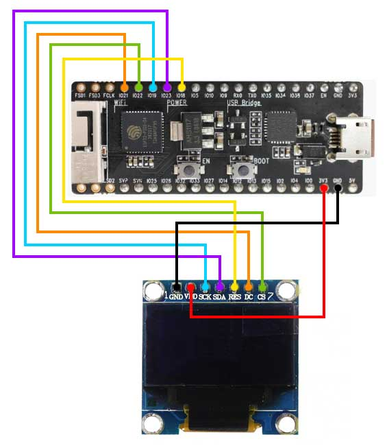

# Using a SSD1306 OLED display with rastr on ESP32

This simple demo shows how to use rastr on ESP32 to draw to an SSD1306 based OLED display. You'll need to install the toolchain, as explained in the [getting started](https://docs.espressif.com/projects/esp-idf/en/latest/get-started/) section of the ESP documentation.

Assuming you already configured your `esp-idf` installation, now you need to:
- Clone this repository **recursively**: `git clone https://github.com/shaduzlabs/sl-esp32-ssd1306-example.git --recursive`
- Go to the example repository directory: `cd sl-esp32-ssd1306-example`
- Configure the project (e.g. the serial port of your device, etc.): `make menuconfig`
- Build the example: `make`
- Flash your device: `make flash`
- Done :)

## Connections

This example is based on an [ESP32 Pico D4 Kit](https://docs.espressif.com/projects/esp-idf/en/latest/get-started/get-started-pico-kit.html), the table and the picture below show the connections between the display and the board. The pins can be changed from the configuration menu (SSD1306 Configuration).

| SSD1306            |  ESP32    |
|--------------------|:---------:|
| VDD                | 3.3V / 5V |
| GND                | GND       |
| SCL (clock)        | 19        |
| SDA (data)         | 23        |
| D/C (data/command) | 21        |
| RST (reset)        | 18        |
| CS  (chip select)  | 22        |

