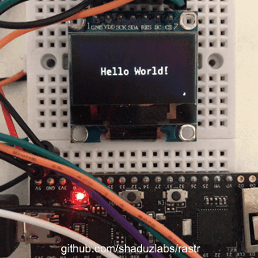

# Using a SSD1306 OLED display with rastr on ESP32

This simple demo shows how to use rastr on ESP32. You'll need to install the toolchain, as explained in the [getting started](https://docs.espressif.com/projects/esp-idf/en/latest/get-started/) section of the ESP32 documentation.

Once the toolchain is installed,

## Connections

This example is based on an [ESP32 Pico D4 Kit](https://docs.espressif.com/projects/esp-idf/en/latest/get-started/get-started-pico-kit.html),

| SSD1306            |      ESP32 SoC      |  ESP32 Pico D4 Kit |
|--------------------|:-------------------:|:------------------:|
| VDD                | 3.3V / 5V           | 3.3V / 5V          |
| GND                | GND                 | GND                |
| SCL (clock)        |                     | 19                 |
| SDA (data)         |                     | 23                 |
| D/C (data/command) |                     | 21                 |
| RST (reset)        | GPIO18              | 18                 |
| CS  (chip select)  |                     | 22                 |

